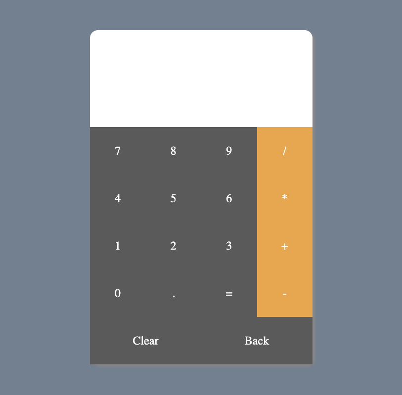

# DISPLAY
Deployed to Vercel: (Welcome test!)
https://react-project-01-calculator.vercel.app/

# Fix Bugs Diary:
    1. Can only perform operations between 0 and 9 (1+1), cannot perform operations like tens or hundreds (11+1) .

    2. Allowed two operations signal input like ++ //, and result in errors after clicking = .

    3. Fixed errors when input text is empty

    4. Fixed errors when clicking = with empty input text or ended with operation signals.

    5. Adjusted CSS when result have multiple digits out of the container

# Improvements:
    1. Added CSS when hovering buttons

    2. Added function 'Back' to undo the last input

# Reference:
    1. ReactJS Tutorial - Build a Calculator App from Scratch
    https://www.youtube.com/watch?v=n_cKSILMzmM

    2. math.js library
    https://mathjs.org/index.html
